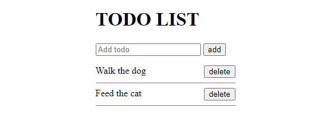

# Todo list v2

A Javascript exercise done during my training at [BeCode](https://becode.org/all-trainings/pedagogical-framework-junior-developer/).

## The Goal

The project was to create a simple "Todo list" using local storage to keep the data entered by the user.

## What does it look like ?

Check the result ➡️ [here](https://dystrima.github.io/TODO-LIST-V2/) ⬅️
 

